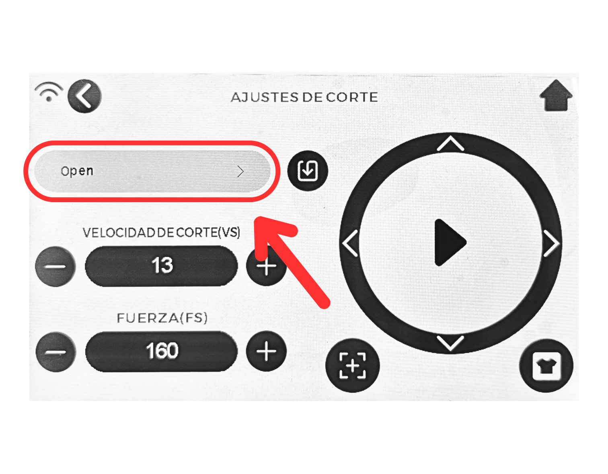

# plotterdecorte_siser_romeo
Protocolo de reserva y uso para la máquina plotter de corte Siser Romeo, ubicada en Exploratec UDD. 

>Romeo es una máquina de corte de alta definición capaz de cortar los detalles más finos en una gran variedad de materiales. Está diseñado para corte de vinilos de transferencia de calor Siser a través de los ajustes de corte preinstalados, pero funciona con otros materiales como cartulina, pegatinas, goma eva y mucho más.

## Considerar:

### Especificaciones técnicas

#### Dimensiones de corte:
El área de trabajo a lo ancho es de 62 cm y el largo máximo de corte es de 457 cm. 

#### Velocidad de corte:
La velocidad de corte máxima de la máquina es 600 mm/s. 
Dentro de la interfaz de la máquina la velocidad se ajusta en una escala de 13 niveles, siendo el nivel 1 la velocidad más baja y el nivel 13 la velocidad más alta (600 mm/s).

#### Fuerza de corte:
La fuerza de corte se refiere a cuánta presión ejerce el cabezal de la máquina sobre el material a cortar. Dentro de la interfaz de la máquina, esta fuerza se ajusta en base a 160 niveles, siendo 1 la menor presión ejercida y 160 la mayor presión ejercida posible.

#### Precisión:
La Romeo es altamente precisa, con una tolerancia de ±0.01 mm. Esto la hace ideal para cortes de diseños complejos o tipografías pequeñas.

Para asegurar resultados óptimos se recomienda asegurar que la cuchilla esté en buen estado, configurar correctamente el origen (punto cero) y usar el mat adhesivo de corte en materiales flexibles o muy delgados.

#### Limitantes mecánicas
- Espesor máximo de corte de 1mm.
- No recomendable para materiales metálicos, acrílicos duros, madera o superficies extremadamente rugosas.
- Cuchillas desgastadas reducen precisión y aumentan errores.
- Si el material no está bien fijado, puede moverse durante el corte.

### Toma de hora
**No disponible aún.**

### Uso 

#### Materiales
La máquina puede trabajar con diversos materiales. En la siguiente tabla encontrarás mayor información sobre los materiales permitidos para corte en ExploraTec. Ante cualquier duda, consulta al equipo del laboratorio para saber si tu material puede ser cortado con la máquina.

| Material permitido | Material prohibido
| ------------- | ------------- |
| Vinilo delgado (>0,1 mm)  | Plásticos |
| Vinilo grueso (<0,1 mm) | Cartón |
| Vinilo textil (0,2 mm) | Acrílico |
| Papel bond/impresora  (0,1 mm) | Metales  |
| Cartulina (0,35 - 0,5 mm) | - |
| Telas delgadas (0,2 - 0,5 mm)  |  -  | 

#### Formatos aceptados
La máquina se acciona mediante un software propietario de la marca Siser, el cual se encuentra disponible para uso dentro del computador designado para esto.
Este software _Leonardo Design Studio_ soporta archivos vectoriales como .dxf, .svg e incluso .png (hace el procesamiento a vector dentro del software, tutorial [AQUÍ](https://www.youtube.com/watch?v=sZp43LRsjFY)), por lo que tu archivo puede ser de cualquiera de esos tipos.

A pesar que dentro del mismo software se pueden hacer distintos diseños con diversos niveles de dificultad, recomendamos traer el archivo vectorial listo hecho en algún programa CAD (vectorial).

##### Carga de material
Para cargar correctamente el material, es necesario utilizar la palanca trasera que controla los rodillos de arrastre. Esta palanca debe bajarse para poder insertar el material con libertad y colocarlo correctamente alineado. 

Además, también pueden ajustarse la distancia entre los rodillos desde la parte trasera de la máquina, para así tener un mejor agarre del material.

Una vez posicionado el material, se sube la palanca para que los rodillos presionen el material y aseguren su desplazamiento estable durante el corte. No forzar el movimiento del material sin levantar la palanca, ya que esto puede dañar los rodillos o desalinear el eje.

##### Calibrar la cuchilla
Para asegurar un corte preciso, es importante calibrar la posición del cabezal antes de comenzar cualquier trabajo. Esto se realiza directamente desde la pantalla táctil de la máquina.

Basta con presionar las flechas direccionales en la interfaz de la máquina, esto hará que el cabeza se mueva a lo largo del eje horizontal, llegando a cualquier punto del material en el cual se desee iniciar.

Para regresar la máquina al punto cero, basta con presionar el botón de “origen” en la interfaz. Esto hará que el cabezal de déplace a la esquina izquierda del eje horizontal.

#### Preset
En términos simples, mientras más grueso el material a cortar menor debería ser la velocidad de corte seleccionada y mayor presión, pero, para expeditar los procesos, hemos diseñado 3 set de configuraciones para distintos materiales basados en sus características. 

Para cargar uno de estos preset debes: 

1. Desde el panel inicial (Home) presionar el botón de “Ajustes de Corte”

2. Una vez en Ajustes de Corte, presiona el botón con el nombre del preset actual (en este caso “Open”) para acceder al menú de Preajustes

3. En el menú de Preajustes, selecciona la sección “Otros”, aquí se encuentran los presets hechos por ExploraTec

4. Selecciona el preset que más se acerque al material que estás intentando cortar

5. Apreta el botón “cargar” 

Para probar el presente en tu material, debes apretar el botón de prueba (icono de polera) que se encuentra al lateral derecho de las flechas direccionales.
Esto generará un pequeño corte de aprox. 1,5 x 1,5 cm en tu material.

Si luego de esta prueba deseas modificar alguna de las variables del corte, comunicate con alguno de los trabajadores del laboratorio para obtener ayuda. No modifiques los presets sin supervisión previa.

#### Recepción de la máquina, uso y entrega
Antes de iniciar el trabajo, se debe verificar que el área de corte del plotter esté limpia y libre de residuos u objetos que puedan obstaculizar el cabezal de corte. Estos elementos pueden interferir con la precisión del corte o provocar fallas mecánicas.
Durante todo el proceso de corte, se debe permanecer atento al funcionamiento de la máquina. Es su responsabilidad supervisar que el corte se esté haciendo de forma correcta.
Al finalizar, el equipo debe entregarse en el mismo estado en que fue recibido, es decir sin restos de material cortado, sin fragmentos de cinta, backing o piezas adheridas al tapete o base.
